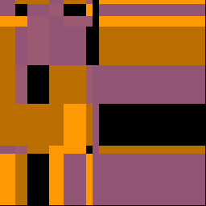

# `rid`

A simple identicon/profile image generation tool.


## Installation

You need a recent version of Rust toolchain.

```sh
git clone https://github.com/shingtaklam1324/rid
cd rid
cargo install
```

## Usage

```txt
rid 0.1.0
Shing Tak Lam
A quick identicon generator

USAGE:
    rid [FLAGS] [OPTIONS] <USERNAME>

FLAGS:
    -m, --multi      Allows for multi-colored image output
    -h, --help       Prints help information
    -V, --version    Prints version information

OPTIONS:
        --hue <HUE>           Hue for the output image, unit: degree
    -o <OUT DIR>
        --salt <SALT>         Salt for the hashing, any string
        --sat <SATURATION>    Saturation for the output image, unit: %
        --seed <SEED>         Seed for the RNG, any valid 32-bit unsigned integer

ARGS:
    <USERNAME>
```

using the `-m` flag or having a `--sat` value greater than 100 will yield multi-coloured images

## More Examples





